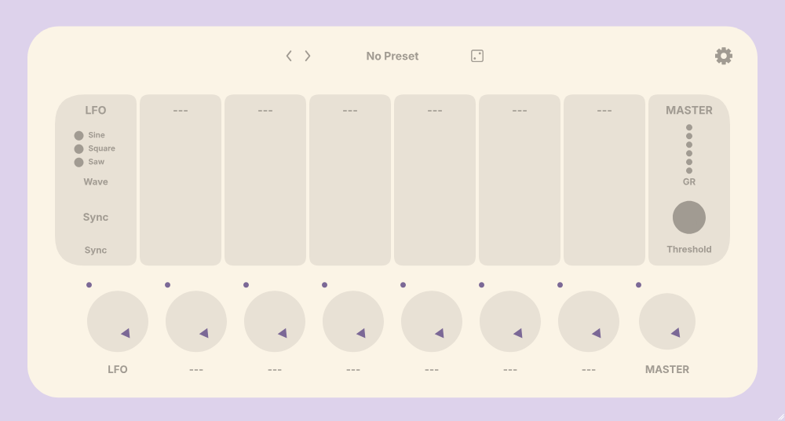
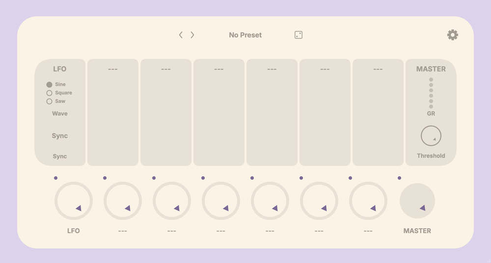

# DDIF → Pulp UI conversion spike

A focused reproducer for converting an existing **JUCE** plugin UI into a
**[Pulp](https://github.com/danielraffel/pulp)** scripted-UI bundle that
[`pulp-embed-juce`](https://github.com/danielraffel/pulp-embed-juce) can render
inside the live plugin. The source project is
[Dream Date Designs](https://dreamdatedesigns.net)' **Dream Date FX** plugin,
built on the YSS framework — but the technique generalizes to any JUCE plugin.

## Result

**99.75% pixel match** against the JUCE-rendered reference (AE @ 10% fuzz =
1331 px out of 536000 in DDIF FX's 1000×536 design space). Residual diff is
rasterizer-level anti-aliasing between Pulp's Skia/Dawn and JUCE's Core Graphics —
not anything we can address from the converter.

| Pulp render | JUCE reference |
|---|---|
|  |  |

## How it works

```
JUCE editor (live)
  ↓ Standalone --ui-export <dir>
yss::UIExporter::exportComponent  → MainEditor.svg, ComponentTree.json, MainEditor.png
  ↓ Scripts/ddif-jsx-from-export.mjs   (this repo)
@pulp/react JSX (one <SvgPath>/<SvgRect> per JUCE paint call, View per JUCE component)
  ↓ pulp/tools/import-design/jsx-runtime/jsx-transform.mjs
918 KB IIFE bundle
  ↓ pulp-cpp import-design --from jsx --mode live --emit js
ui.js (embed-ready)
  ↓ pulp_embed_create_from_ui_bundle  (or pulp-embed-bundle-render headless)
Live Metal/Skia render
```

The key insight: **yssUI's pre-existing `SVGGraphicsContext` + `UIExporter`
already produce a vector trace of every JUCE paint call.** No need to port
LookAndFeel methods or write a JUCE → Canvas2D translator. Pulp's `<SvgPath>`
intrinsic consumes that SVG more or less verbatim.

## What's in here

| Path | What |
|---|---|
| `Scripts/ddif-jsx-from-export.mjs` | The converter — walks ComponentTree.json + MainEditor.svg, emits a single JSX file with `@pulp/react` intrinsics |
| `Scripts/ddif-pulp-diff.sh` | Visual diff harness (ImageMagick `compare`) — outputs strict/fuzz/MAE metrics + a diff overlay |
| `Scripts/ddif-pulp-pipeline.sh` | One-shot: re-export DDIF → convert → bundle → render → diff in ~10 seconds |
| `Scripts/setup-pulp.sh` | Bootstrap: clone the three Pulp forks, switch `pulp` to the embedding seam branch, build + install the SDK |
| `CMake/yssPulp.cmake` | Drop-in CMake helper for any YSS-based plugin to opt into Pulp UI |
| `Docs/PulpIntegration.md` | **Full project log** — every blocker, every silent failure mode, every open question for Daniel |
| `patches/*.diff,patch` | The DDIF, yssUI, and pulp-embed-juce edits that came out of the spike |
| `renders/` | The pixel-pair from the diff that scores 99.75% |

## Reading order for Daniel

1. **`Docs/PulpIntegration.md`** — the full story, including the section
   "Open questions (for Daniel)" which has 8 specific items I couldn't
   resolve without you. Three of them are silent rendering failures (`#6`–`#8`)
   that all might be facets of one underlying `@pulp/react` bridge bug.

2. **`patches/03-pulp-embed-juce-skip-fetch.patch`** — already open as
   [matthewfudge/pulp-embed-juce#1](https://github.com/matthewfudge/pulp-embed-juce/pull/1)
   (within-fork PR per your suggested workflow). Fixes a JUCE
   FetchContent collision for parents that bring their own JUCE.

3. **`Scripts/ddif-jsx-from-export.mjs`** — the converter itself,
   ~250 lines. The classification + emit logic is short and the comments
   explain every workaround.

4. **`patches/02-yssui-uiexporter-text-capture.patch`** — the YSS-side
   change to capture `Label::getText()` / `Button::getButtonText()` /
   `TextEditor::getText()` in the manifest so labels show real DDIF text
   instead of class names.

## Open questions blocking pixel-perfect interactivity

See `Docs/PulpIntegration.md` "Open questions (for Daniel)" for full
context. The headline items:

- **q1**: `PulpEmbedComponent` doesn't expose the host-param bridge that
  the C ABI (`pulp_view_embed.h` ABI v2/v3) supports. Without `bindHost()`
  or equivalent, knobs/sliders in the embedded UI don't drive plugin
  parameters — they're visual only.
- **q6**: `@pulp/react` silently renders blank when total widget count
  exceeds ~152. Bisected — 152 ok, 153 blank. Doesn't matter what they
  are; doesn't matter if bucketed into nested Views. Likely a hard cap
  or counter overflow in the bridge.
- **q7**: emitting the first 70 SVG paths in JUCE doc order renders fine;
  picking the 70 largest-by-area from the same set renders blank. Same
  count, same content. Path ORDER affects render success.
- **q8**: merging consecutive same-style `<SvgPath>` elements into one
  compound path (multiple `M` subpaths in `d=`) renders blank — even
  though a single compound path with 52 `M` subpaths renders fine alone.

If q6-q8 all share a root cause, that's the one thing between us and
full pixel parity. Until then the converter caps SVG primitives at 151
(the cliff edge) and drops widget emission to let the SVG layer carry
the pixels.

## License

MIT, same as `pulp-embed-juce`. Source DDIF code is not included here —
only the conversion artifacts.
